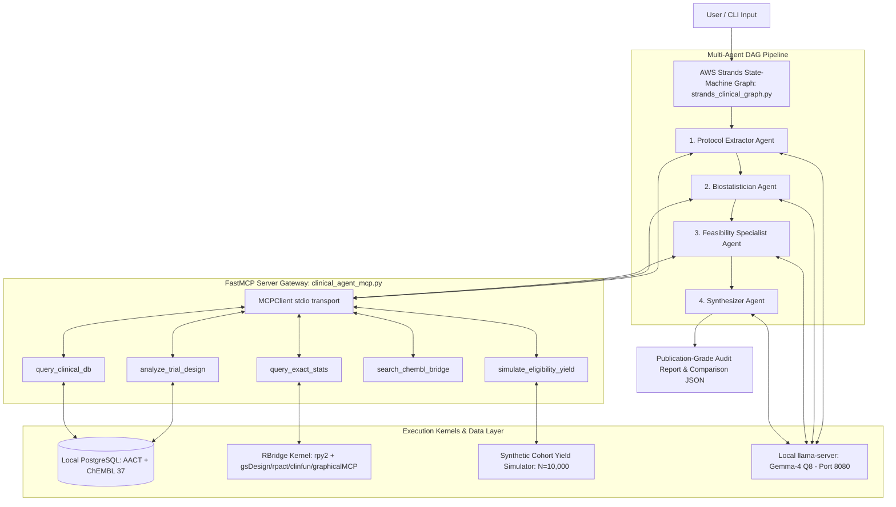

# Clinical Trial Analysis Agent

An automated, local-first clinical trial analysis and audit system powered by **AWS Strands Agents SDK**, **FastMCP**, local **PostgreSQL (AACT + ChEMBL 37)**, and an **RPy2 Statistical Kernel**. Protocol classifications are guided by **Friedman, Furberg & DeMets, *Fundamentals of Clinical Trials* (4th ed.)**.

---

## 🏗️ Architecture Overview



---

## 🌟 Key Features

1.  **🕸️ AWS Strands State-Machine Graph (`strands_clinical_graph.py`):**
    *   Deterministic Directed Acyclic Graph (DAG) orchestration: `protocol_extractor ➔ biostatistician ➔ feasibility_specialist ➔ synthesizer`.
    *   State-channel isolation keeps prompt sizes < 2,000 tokens per node, permanently resolving context bloat (`MaxTokensReachedException`).

2.  **🔌 FastMCP Stdio Server Interface (`clinical_agent_mcp.py`):**
    *   Exposes 5 tools (`analyze_trial_design`, `simulate_eligibility_yield`, `query_exact_stats`, `search_chembl_bridge`, `query_clinical_db`).
    *   Protected by `@redirect_stdout_to_stderr` wrapper to ensure zero stdio stream corruption over JSON-RPC.

3.  **📊 RBridge Statistical Kernel (`clintrial_agent/stats/r_bridge.py`):**
    *   Direct `rpy2` bindings for textbook-standard statistical packages:
        *   `gsDesign` & `gsDesign2`: Fixed-sample and non-proportional hazards log-rank boundary calculations.
        *   `rpact`: Group-sequential designs & alpha spending functions.
        *   `clinfun`: Simon's optimal/minimax Phase II 2-stage designs.
        *   `PowerTOST`: Bioequivalence and crossover trial power.
        *   `dfcrm`: Continual Reassessment Method (CRM) for Phase 1 dose-finding.
        *   `graphicalMCP`: Maurer-Bretz multi-endpoint alpha recycling.

4.  **🗄️ Local PostgreSQL AACT & ChEMBL 37 Database Integration:**
    *   Direct queries against local AACT tables and ChEMBL drug target mapping bridges with automatic ClinicalTrials.gov API fallback.

5.  **🧮 Synthetic Cohort & Eligibility Yield Simulator (`clintrial_agent/eligibility/`):**
    *   Deterministic criteria constraint parser generating $N=10,000$ synthetic patient populations to simulate screen-to-enrollment yields and criteria relaxation multipliers.

6.  **🚀 Local Open-Weight LLM Backend (Gemma-4 Q8):**
    *   Powered by `llama-server` running `gemma-4-E2B-it-Q8_0.gguf` on port 8080 with a 16,384 context window. Benchmark evaluated against Qwythos 9B (see [`MODEL_BENCHMARK.md`](MODEL_BENCHMARK.md)).

---

## ⚙️ Requirements & Installation

*   **Python:** 3.12
*   **R Engine:** R $\ge$ 4.2 installed with packages: `gsDesign`, `gsDesign2`, `clinfun`, `rpact`, `PowerTOST`, `dfcrm`, `graphicalMCP`.
*   **Database:** Local PostgreSQL running on `localhost:5432` with `chembl_37` schema.
*   **Dependencies:** Managed via `uv`:

```bash
uv venv .venv --python 3.12
source .venv/bin/activate
uv sync
```

---

## 🏃 Quickstart & Execution

### 1. Start Local LLM Server (Gemma-4 Q8)
In a dedicated terminal, launch `llama-server` with 16K context window:
```bash
/opt/homebrew/bin/llama-server -m ~/.cache/huggingface/hub/models--ggml-org--gemma-4-E2B-it-GGUF/snapshots/a1dac71d3ab220618f5a7573a52acdc4baf3ae3b/gemma-4-E2B-it-Q8_0.gguf -c 16384 --port 8080
```

### 2. Run Deterministic State-Machine Graph
Run the full 4-stage multi-agent graph pipeline across target trials:
```bash
source .venv/bin/activate
python strands_clinical_graph.py --trials NCT06625320 NCT06088043 NCT07262619 --comparison-name portfolio_audit
```

### 3. Run FastMCP Server
Run or inspect the stdio MCP server tools:
```bash
uv run clinical_agent_mcp.py
```

### 4. Run Legacy Swarm
Run the cooperative Swarm orchestrator:
```bash
python strands_clinical_swarm.py --trials NCT06625320 NCT06088043 NCT07262619 --comparison-name swarm_audit
```

### 5. Run Self-Testing Validation Suite
Verify database connections, RBridge solvers, and MCP tools:
```bash
python validate_pipeline.py
```

---

## 📚 Technical Documentation & Guides

*   📄 [MODEL_BENCHMARK.md](MODEL_BENCHMARK.md) — Empirical comparison of Gemma-4 Q8 vs Qwythos 9B local backends.
*   📄 [strands_architectures_comparison.md](strands_architectures_comparison.md) — Multi-agent topology trade-off analysis (Swarm vs. State-Machine DAG).
*   📄 [token_limit_remediation.md](token_limit_remediation.md) — Strategies for eliminating context window bloat and `MaxTokensReachedException`.
*   📄 [memory_observability_learning.md](memory_observability_learning.md) — Blueprint for OpenTelemetry (Langfuse/Phoenix) tracing, RAG vector memory, and self-correction.

---

## 📂 Output Directory Structure

*   `analysis_json/{NCT_ID}_graph_report.txt` — Individual publication-grade assessment reports.
*   `analysis_json/{comparison_name}_graph_comparison.json` — Portfolio-level structured comparisons.
*   `images/` — Power curve PNG visualizations generated by `power_visualization.py`.

---

## 📜 License & Citation

Licensed under MIT. Clinical classifications strictly derived from:
> Friedman, L. M., Furberg, C. D., DeMets, D. L., Reboussin, D. M., & Granger, C. B. (2015). *Fundamentals of Clinical Trials* (4th ed.). Springer.
