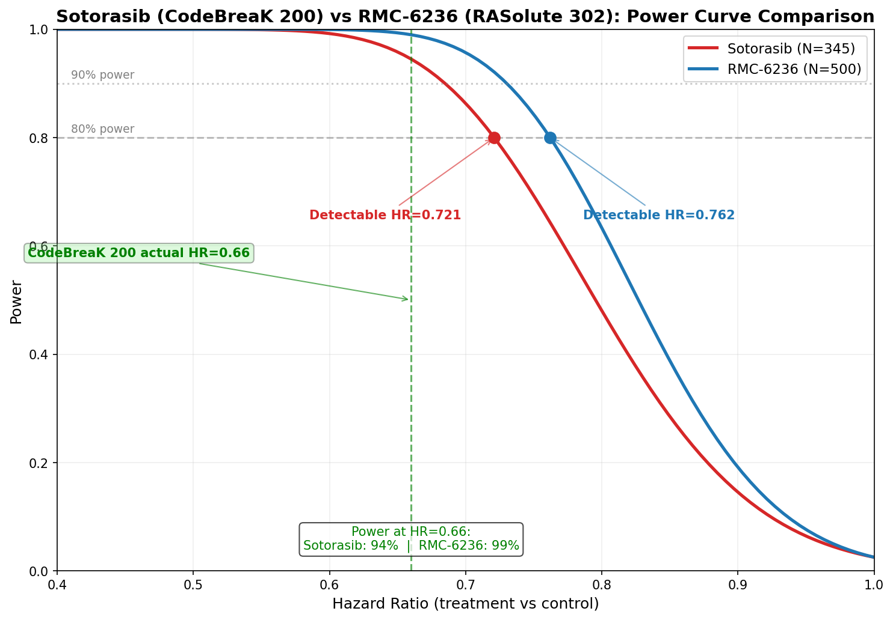
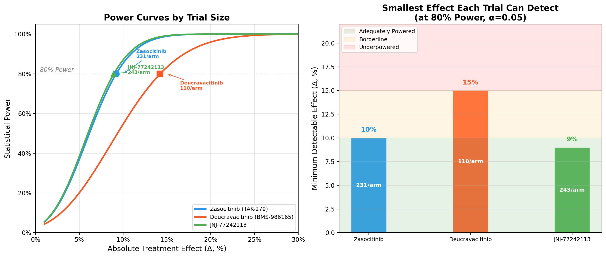
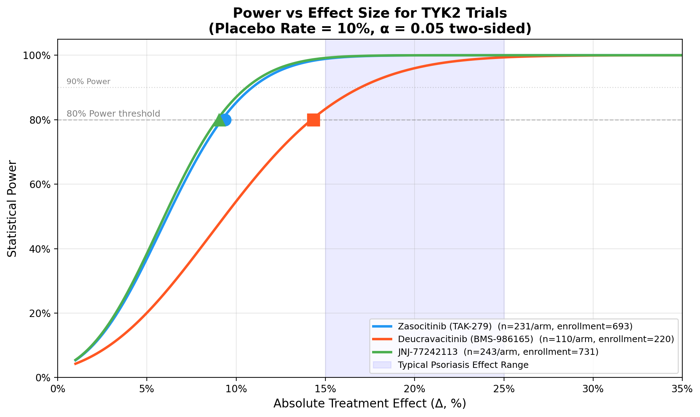

# Clinical Trial Analysis Agent

An automated clinical trial analysis pipeline that classifies protocol characteristics from [ClinicalTrials.gov](https://clinicaltrials.gov/) API data, guided by **Friedman, Furberg & DeMets, *Fundamentals of Clinical Trials* (4th ed.)**.

## Overview

This agent fetches trial data via the ClinicalTrials.gov v2 API and runs a multi-step analytical pipeline. Each step corresponds to a chapter from the textbook. The LLM (Gemma2 via Ollama) is used exclusively for **eligibility criteria classification**; all other analysis is algorithmic using the structured API data.

All tunable constants — statistical parameters, keyword dictionaries, thresholds, LLM settings, default trials — live in [`pipeline_config.yaml`](pipeline_config.yaml), with each value annotated with its textbook rationale or marked as an oncology-specific heuristic. The pipeline has zero hardcoded constants.

### Pipeline Steps

| Step | Textbook Chapter | Function | What It Does |
|------|-----------------|----------|-------------|
| 1 | **Ch 5 — Study Design** | `classify_design_from_api()` | Design type (Parallel RCT, Crossover, Adaptive Design, Single-Arm, etc.), control type, superiority type — all from API allocation/intervention model/arm types. Handles Phase 1/2 oncology dose-escalation (Single-Arm, Adaptive Design) vs Phase 3 confirmatory (Parallel RCT) |
| 2 | **Ch 3 — Endpoints** | `classify_endpoint_type()` | Primary/secondary outcomes classified as Surrogate, Clinical, Composite, Patient-Reported, Safety, or Biomarker. Includes oncology-specific terms: DLT/MTD → Safety, RECIST/ORR/PFS/OS → Surrogate/Clinical, PK/AUC/Cmax → Biomarker |
| 3 | **Ch 4 — Study Population** | `analyze_study_population()` | Sex, age range, competing risk exclusions, recruitment yield estimate |
| 4 | **Ch 8 — Sample Size / Power** | `analyze_sample_size()` | **Three dispatch modes**: (a) **Dichotomous** — detectable absolute difference via normal approximation for proportion-based endpoints (e.g., PASI-75, ORR). (b) **Survival** — detectable hazard ratio via Schoenfeld event-count formula for PFS/OS endpoints. (c) **Phase 1** — returns N/A with explanation. **Indication-parameterized**: control event rate, median survival, and event rate are looked up from `pipeline_config.yaml` by inferred indication |
| 5 | **Ch 6 — Randomization** | `analyze_randomization()` | Randomization type (Simple/Blocked/Stratified/Adaptive), allocation ratio, stratification factors — keyword detection from protocol text |
| 6 | **Ch 7 — Blindness** | (in `trial_integrity`) | API masking normalized via configurable `masking_map`: QUADRUPLE/TRIPLE/DOUBLE → Double-blind, SINGLE → Single-blind, NONE → Open-label |
| 7 | **Ch 19 — Adaptive Designs** | `analyze_adaptive_design()` | Detects Group Sequential, Sample Size Re-estimation, Response-Adaptive Randomization, Basket/Umbrella/Platform, Dose-Finding, Seamless Phase 2/3. Also detects dose-escalation method (3+3, CRM, Bayesian) |
| 8 | **Ch 12 — Safety / AEs** | `analyze_safety_adverse_events()` | Extracts AE terms from protocol text, classifies reporting method (MedDRA/CTCAE grading), detects DSMB and SAE stopping rules |
| 9 | **LLM Classification** | Ollama (model from config) | Eligibility criteria classified into Safety / Statistical Power / Feasibility with justifications. **Batched** (batch size from config, default 20) to avoid truncation |

## Requirements

- Python 3.12
- [Ollama](https://ollama.ai/) with `gemma2:2b-instruct-q4_K_M` (or model specified in config)
- Dependencies managed with `uv`:

```bash
uv venv .venv --python 3.12
source .venv/bin/activate
uv sync
```

## Usage

```bash
source .venv/bin/activate

# Analyze default trials (from pipeline_config.yaml)
python design_agent_pipeline.py

# Analyze specific trials
python design_agent_pipeline.py --trials NCT04167462 NCT04303780

# Custom comparison name
python design_agent_pipeline.py --trials NCT04167462 --comparison-name my_study

# Single trial via Python API
python -c "from design_agent_pipeline import analyze_trial; analyze_trial('NCT_ID')"

# Entry point
clinical-agent

# Generate power curve images
python power_visualization.py
```

## 📊 Statistical Bridge (RBridge)

The agent integrates direct ABI-compatible R package wrappers using `rpy2` under a unified `RBridge` class ([clintrial_agent/stats/r_bridge.py](file:///Users/leelasdodda/Documents/Codes/local_clintrial_agent/clintrial_agent/stats/r_bridge.py)), allowing exact mathematical calculations beyond fixed-sample formulas:

*   **Group Sequential Designs (`rpact`):** Exact sample size, event counts, and boundary inflation factors using O'Brien-Fleming or Pocock alpha spending functions.
*   **Simon's Two-Stage Design (`clinfun`):** Minimax and optimal sample sizes and critical values for Phase II oncology screening.
*   **Non-Proportional Hazards (`gsDesign2`):** Sample size and event counting under non-proportional hazards (NPH) assumptions using MaxCombo or average hazard ratio solvers.
*   **Graphical Multiplicity (`graphicalMCP`):** Exact alpha recycling and step-down testing rejections for multiple co-primary endpoints.

---

## 🔌 Model Context Protocol (MCP) Server

The agent exposes a standardized **FastMCP Server** ([clinical_agent_mcp.py](file:///Users/leelasdodda/Documents/Codes/local_clintrial_agent/clinical_agent_mcp.py)) over stdio transport. It registers 5 production-grade tools:

1.  **`analyze_trial_design`**: Runs the complete textbook-aligned analysis on any study by NCT ID.
2.  **`simulate_eligibility_yield`**: Evaluates inclusion/exclusion criteria restrictiveness, generating a synthetic cohort and simulating relaxation multipliers.
3.  **`query_exact_stats`**: Dispatches study parameters to the RBridge solver (`rpact`, `clinfun`, `gsDesign`, `gsDesign2`, `graphicalMCP`).
4.  **`search_chembl_bridge`**: Queries intervention target structures in ChEMBL.
5.  **`query_clinical_db`**: Secure, `SELECT`-only SQL gateway to the local AACT PostgreSQL database.

### Registration:
The server is registered globally inside `~/.gemini/config/mcp_config.json`. To run manually:
```bash
uv run clinical_agent_mcp.py
```

---

## 🤖 AWS Strands Multi-Agent Swarm (Under Development)

We have authored an architectural design proposal to migrate this pipeline to the **AWS Strands Agents SDK** ([strands_agent_integration_proposal.md](file:///Users/leelasdodda/Documents/Codes/local_clintrial_agent/strands_agent_integration_proposal.md)):
*   **Collaborative Swarm:** Organizes specialized agents (*Extractor*, *Biostatistician*, *Safety*, *Feasibility*) coordinating state and context using autonomous handoffs.
*   **Local Inference Backends:** Supports local **Ollama** (`gemma2:2b`) and high-performance **llama.cpp** servers running cached model files (e.g. `gemma-4-E2B-it-Q8_0.gguf`) with Metal GPU acceleration.
*   **Decoupled MCP Integration:** Uses `MCPClient` and `StdioServerParameters` stdio transport to bind our MCP server tools directly into the agents.

---

## 🧪 Pipeline Validation Suite

The agent includes a self-testing validation suite ([validate_pipeline.py](file:///Users/leelasdodda/Documents/Codes/local_clintrial_agent/validate_pipeline.py)) to verify database connectivity, statistical bridge exact calculations, and MCP safety guardrails:
```bash
python validate_pipeline.py
```

---

## Configuration

All pipeline behavior is controlled by [`pipeline_config.yaml`](pipeline_config.yaml) (490 lines, 30+ top-level keys). The file must be in the same directory as `design_agent_pipeline.py`. Key sections:

| Section | What It Controls | Rationale |
|---------|-----------------|-----------|
| `alpha`, `power_target` | Significance level, power target | Textbook Ch 8: α=0.05 and 1−β=0.80 are conventional defaults |
| `dichotomous_power_assessment` | Thresholds for Adequately Powered / Borderline / Underpowered | Oncology heuristic, not textbook-standard |
| `survival_power_assessment` | HR thresholds for survival power assessment | Oncology heuristic, not textbook-standard |
| `survival_defaults` | Fallback median OS, PFS, event rate | Textbook Ch 8 exponential model |
| `default_control_rate_dichotomous` | Fallback control rate for dichotomous endpoints | Oncology heuristic: 10% placebo floor |
| `realistic_improvement_absolute` | Absolute improvement for "Power@N%" reporting | Reporting convention |
| `indication_params` | Per-indication control rates, medians, event rates | Textbook Ch 8: indication-specific parameters required |
| `default_indication_params` | Fallback when indication is unknown | Same structure as `indication_params` entries |
| `indication_keywords` | Maps indication keys to detection keywords | Used by `infer_indication()` |
| `masking_map` | Normalizes API masking codes to standard terms | Textbook Ch 7: QUADRUPLE/TRIPLE → Double-blind |
| `endpoint_keywords` | Safety, Clinical, Surrogate, Biomarker, etc. | Textbook Ch 8 outcome type taxonomy |
| `survival_keywords`, `dichotomous_keywords` | Dispatch power analysis by endpoint type | Textbook Ch 8: dichotomous vs survival |
| `adaptive_signals` | 8 adaptive design types + keyword lists | Textbook Ch 19 |
| `stratification_factor_keywords` | Detect stratification from protocol text | Textbook Ch 6 |
| `drug_class_effects` | Drug-class-specific adverse events | Extensible; TYK2 entry from clinical literature |
| `general_ae_terms` | Common AE term normalization | Cross-therapeutic-area AEs |
| `safety_reporting_keywords` | MedDRA, CTCAE, elicited, volunteered detection | Textbook Ch 12 |
| `dsmb_keywords`, `sae_stopping_keywords` | DSMB and SAE stopping rule detection | Textbook Ch 12 |
| `stopping_rule_keywords` | O'Brien-Fleming, Pocock, Lan-DeMets, etc. | Textbook Ch 19 |
| `dose_escalation_keywords` | CRM, Bayesian, 3+3, rolling six | Phase 1 dose-finding methods |
| `llm` | Model, batch size, temperature, num_predict | Ollama parameters |
| `default_trials` | NCT IDs + drug names for `__main__` | Replaces hardcoded trials |
| `default_comparison_name` | Output filename prefix for comparisons | Configurable portfolio naming |
| `api_base_url` | ClinicalTrials.gov API endpoint | Default: v2 API |

## Output

### Per-trial: `analysis_json/{NCT_ID}_analysis.json`

Full JSON with all analysis sections:

```json
{
  "nct_id": "NCT06088043",
  "title": "A Study About How Well TAK-279 Works...",
  "phase": "PHASE3",
  "indication": "psoriasis",
  "eligibility": [
    {
      "text": "Plaque psoriasis for at least 6 months",
      "reasoning_category": "Statistical Power",
      "justification": "...",
      "competing_risk": false
    }
  ],
  "criteria_metadata": {
    "total_parsed": 7,
    "classified": 7,
    "batches": 1,
    "batch_size": 20
  },
  "population": { "..." },
  "sample_size": {
    "enrollment_actual": 693,
    "estimated_n_per_arm": 231,
    "num_arms": 3,
    "primary_endpoint_type": "Dichotomous (Proportion)",
    "estimated_control_event_rate": 0.1,
    "indication_params_used": { "control_rate_dichotomous": 0.1 },
    "power_analysis": {
      "alpha": 0.05,
      "power_target": 0.80,
      "detectable_absolute_difference": 0.100,
      "estimated_power_for_20pct_improvement": 1.0,
      "assessment": "Adequately Powered"
    }
  },
  "endpoints": [ "..." ],
  "trial_integrity": { "..." },
  "trial_design": {
    "design_type": "Parallel RCT",
    "control_type": "Placebo",
    "superiority_type": "Superiority"
  },
  "randomization": { "..." },
  "adaptive_designs": { "..." },
  "safety_adverse_events": { "..." },
  "summary": { "Safety": 3, "Statistical Power": 2, "Feasibility": 2 }
}
```

### Combined Comparison Files

- `analysis_json/{name}_comparison.json` — multi-trial comparisons (name from `--comparison-name` or config `default_comparison_name`)

### Visualization



Power curve comparison between Sotorasib (CodeBreaK 200, N=345) and RMC-6236 (RASolute 302, N=500). The vertical dashed line marks the actual published HR from CodeBreaK 200 (HR=0.66).



Power curves for all three TYK2 psoriasis trials (Zasocitinib, Deucravacitinib, JNJ-77242113).



Detectable effect size vs sample size comparison across TYK2 trials.

## Power Analysis

The pipeline supports three types of power analysis depending on endpoint. All modes use **indication-specific parameters** from `pipeline_config.yaml`, inferred from the trial's conditions and title:

| Indication | Control Rate (Dichotomous) | Median OS (mo) | Median PFS (mo) | Event Rate |
|---|---|---|---|---|
| psoriasis | 0.10 | — | — | — |
| nsclc | 0.30 | 12.0 | 4.5 | 0.80 |
| pdac | 0.05 | 6.0 | 3.5 | 0.85 |
| msi_h_tumor | 0.15 | 18.0 | 5.0 | 0.75 |
| solid_tumor | 0.15 | 10.0 | 4.0 | 0.80 |

### 1. Dichotomous (Proportion-based)
For endpoints like PASI-75, ORR. Uses normal approximation to compute detectable absolute difference at configured power target.

### 2. Survival (Time-to-event)
For endpoints like PFS, OS. Uses **Schoenfeld event-count formula** from Ch 8:
```
D = (Zα + Zβ)² / [p(1-p) × ln(HR)²]
```
Outputs detectable HR, implied median improvement in months, and expected number of events.

### 3. Phase 1 Safety / Dose-Finding
Returns `N/A — Phase 1 trial, not powered for efficacy`.

## Trials Analyzed

### TYK2 Inhibitors (Psoriasis)

| NCT ID | Drug | Phase | Design | Arms | Enrollment | Power Assessment |
|--------|------|-------|--------|------|-----------|-----------------|
| NCT06088043 | Zasocitinib (TAK-279) | Phase 3 | Parallel RCT, placebo + active comparator | 3 | 693 | Adequately Powered |
| NCT04167462 | Deucravacitinib (BMS-986165) | Phase 3 | Parallel RCT, placebo | 2 | 220 | Borderline |
| NCT06220604 | JNJ-77242113 | Phase 3 | Parallel RCT, placebo + active comparator | 3 | 731 | Adequately Powered |

### WRN Inhibitors (Oncology)

| NCT ID | Drug | Phase | Design | Indication |
|--------|------|-------|--------|-----------|
| NCT07262619 | EIK1005 | Phase 1/2 | Adaptive Design | MSI-H tumor |
| NCT06710847 | GSK4418959 (SYLVER) | Phase 1/2 | Adaptive Design | Solid tumor |
| NCT06898450 | NDI-219216 | Phase 1/2 | Adaptive Design | Solid tumor |

### Revolution Medicines KRAS Portfolio

| NCT ID | Drug | Phase | Design | Indication |
|--------|------|-------|--------|-----------|
| NCT03634982 | RMC-4630 (SHP2) monotherapy | Phase 1 | Single-Arm | Solid tumor |
| NCT03989115 | RMC-4630 + Cobimetinib | Phase 1/2 | Single-Arm | NSCLC |
| NCT05054725 | RMC-4630 + Sotorasib | Phase 2 | Adaptive Design | NSCLC |
| NCT05462717 | RMC-6291 (KRAS G12D) | Phase 1 | Single-Arm | Solid tumor |
| NCT06040541 | RMC-9805 (KRAS G12D) | Phase 1 | Single-Arm | Solid tumor |
| NCT07349537 | RMC-5127 (KRAS G12V) | Phase 1 | Single-Arm | Solid tumor |
| NCT05379985 | RMC-6236 daraxonrasib (RAS multi) | Phase 1/2 | Single-Arm | Solid tumor |
| NCT06162221 | RAS(ON) inhibitors NSCLC | Phase 1/2 | Single-Arm | NSCLC |
| NCT06445062 | RAS(ON) inhibitors GI | Phase 1/2 | Single-Arm | Solid tumor |
| **NCT06625320** | **RMC-6236 daraxonrasib (PDAC)** | **Phase 3** | **Parallel RCT** | **PDAC** |

### Sotorasib (KRAS G12C)

| NCT ID | Drug | Phase | Design | Indication |
|--------|------|-------|--------|-----------|
| NCT04303780 | Sotorasib (CodeBreaK 200) | Phase 3 | Parallel RCT | NSCLC |

## Key Design Decisions

- **Config-driven architecture** — all constants, thresholds, keyword dictionaries, and LLM parameters live in `pipeline_config.yaml` with textbook rationale annotations. Zero hardcoded values in the pipeline code.
- **Design classification** from structured API data (not LLM) — allocation, intervention model, arm types are deterministic.
- **Indication inference** from protocol conditions and title — maps to config `indication_params` lookup. Falls back to `default_indication_params` when indication is unknown.
- **Power analysis** uses indication-specific control event rates, median survivals, and event rates from config. The `indication_params_used` field in the output shows which parameters drove the calculation.
- **Criteria batching** — eligibility criteria are chunked into batches (size from config, default 20) and sent to the LLM sequentially. The `criteria_metadata` field tracks total parsed, classified, and batch count.
- **Survival power** uses the Schoenfeld event-count formula from Ch 8, the standard method for PFS/OS trials.
- **Randomization analysis** via keyword heuristics from protocol text (not LLM).
- **LLM role** limited to eligibility criteria classification into Safety/Statistical Power/Feasibility, informed by design context.
- **Masking normalized** per textbook convention via configurable `masking_map`: Ch 7 defines double-blind as participant + investigator blinded, so QUADRUPLE/TRIPLE → Double-blind.
- **Adaptive design detection** distinguishes API model names (SEQUENTIAL = dose escalation) from true adaptive design features (group sequential, sample size re-estimation, etc.).
- **CLI interface** — `--trials` flag for specifying NCT IDs, `--comparison-name` for custom output naming. No need to edit source code to analyze different trials.

## Related Work

### `wei-ai-lab/clinical-trial-design`

Repository: [github.com/wei-ai-lab/clinical-trial-design](https://github.com/wei-ai-lab/clinical-trial-design) · Apache-2.0 · pre-beta (v0.0.13)

A **Claude Code plugin + MCP server for prospective Phase 2/3 trial design** — the complementary direction to this project. Where `local_clintrial_agent` *analyzes* existing trials from ClinicalTrials.gov, `clinical-trial-design` *sizes* new trials from a design brief, backed by validated R packages (`gsDesign`, `gsDesign2`, `graphicalMCP`).

| | `clinical-trial-design` | `local_clintrial_agent` (this repo) |
|---|---|---|
| Direction | **Prospective design** (compute N / power / boundaries) | **Analysis** of existing trials from ClinicalTrials.gov |
| Engine | Validated R packages (`gsDesign`, `gsDesign2`, `graphicalMCP`) | Algorithmic + local Ollama LLM |
| Group-sequential / NPH | ✅ full (OBF/Pocock spending, MaxCombo/RMST/WLR/AHR) | ❌ fixed-sample textbook formulas only |
| Multi-hypothesis alpha control | ✅ (co-primary, multi-population, Maurer-Bretz) | ❌ |
| Operational kernel (accrual ↔ duration ↔ N) | ✅ solver with feasibility warnings | partial |
| Monte-Carlo verification | ✅ `verify_design` (±2 pp power / ±0.5 pp Type I) | ❌ |
| Interface | MCP server (Claude Code / any MCP client) | CLI (`design_agent_pipeline.py`) |
| Reporting | Markdown / Word / PDF | JSON + PNG plots |
| Tests | 288 testthat + 18 MCP smoke + CI security gate | none |

**Integration potential:** the two could be composed — e.g. feed a ClinicalTrials.gov-sourced design brief into `design_*` to sanity-check whether the original sample size was appropriate, or adopt `verify_design`'s Monte-Carlo convention as a credibility floor for our own power calculations. Full notes in [`research.md`](research.md).

### `adityashukla8/clinicaltrials-multiagent` ("Criteria-AI")

Repository: [github.com/adityashukla8/clinicaltrials-multiagent](https://github.com/adityashukla8/clinicaltrials-multiagent) · no license · hackathon-style demo · 7 stars

A Python multi-agent system (LangGraph + Gemini 2.5 Flash) for **patient-to-trial matching** and **eligibility-criteria optimization for recruitment** — the operational/recruitment leg of the trial lifecycle. Where this repo *assesses* trial design and `clinical-trial-design` *sizes* trials, Criteria-AI *matches patients* to trials and *widens eligibility criteria* (age range, biomarker thresholds) to estimate enrollment-yield gain.

| | `clinicaltrials-multiagent` | `local_clintrial_agent` (this repo) |
|---|---|---|
| Goal | Patient-trial matching + criteria widening for recruitment | Protocol design assessment (power, masking, randomization) |
| LLM | Hosted Gemini 2.5 Flash | Local Ollama `gemma2:2b` |
| Orchestration | LangGraph `StateGraph` (typed-state, conditional edges, supervisor) | Single-file sequential pipeline |
| Trial source | CT.gov by diagnosis + Phase3/4/US/recruiting filter | CT.gov by NCT ID |
| Enrichment | 18 parallel Tavily web searches per trial | API structured fields only |
| Power / stats | ❌ | ✅ dichotomous + survival |
| Tests | ❌ | ❌ |

**Integration potential:** the LangGraph typed-state multi-agent pattern is a cleaner orchestration shape than our single-file sequential pipeline (parallel design/endpoints/power/masking/adaptive/safety steps with a fan-in). Their eligibility-widening simulation is conceptually adjacent to our `analyze_study_population()` recruitment-yield estimate. Caveats: hackathon-grade code (ipdb imports, hardcoded GCP project, match-bias prompt, brittle JSON parsing) — borrow *patterns*, not code. Full notes in [`research.md`](research.md).

### `Keiji-AI/PyTrial` — ⚠️ unmaintained ML toolkit

Repository: [github.com/Keiji-AI/PyTrial](https://github.com/Keiji-AI/PyTrial) · BSD-2 (code) · v0.0.6 Jun 2023 · 127★

A Python ML platform (Sunlab) with a unified `fit/predict/save/load` API across 6 trial tasks. The most complete open-source ML toolkit for the trial lifecycle, but **unmaintained** (last release Jun 2023, Python 3.7 target) with a **heavy dependency stack** (rdkit, transformers, ctgan, transtab). Do not add as a dependency; vendor specific modules instead.

| Capability | PyTask / Model | What it adds to our pipeline |
|---|---|---|
| Trial outcome prediction | `trial_outcome/HINT` | Predicts phase-specific approval probability from `{drug SMILES, ICD codes, eligibility criteria}` — a "will this trial succeed?" field we don't have. ⚠️ TOP benchmark dataset is non-commercial-use only. |
| Trial similarity search | `trial_search/Trial2Vec` | Learned dense-retrieval similarity over trial documents — would replace our indication-only portfolio comparison with embedding-based similarity. |
| Deterministic criteria splitting | `data/trial_data.py:_split_protocol` | Port the inclusion/exclusion splitter to run *before* our LLM classification node — reduces LLM token load, makes the split auditable, zero new deps. |
| Synthetic patient simulation | `trial_simulation/tabular/{CTGAN, GaussianCopula}` | Generate synthetic cohorts for the enrollment-yield simulation in issue #9 — avoids needing Criteria-AI's AppWrite patient DB. |

Full in-depth analysis (architecture, all 6 tasks, code-level findings, dependency stack, integration recommendation) in [`research.md`](research.md).

## Files

| File | Purpose |
|------|---------|
| `design_agent_pipeline.py` | Main pipeline — orchestrates all analysis steps (1073 lines) |
| `pipeline_config.yaml` | All tunable constants with textbook rationale (490 lines, 30+ keys) |
| `agent_prompt.txt` | LLM prompt with JSON schema |
| `power_visualization.py` | Power curve plots |
| `pyproject.toml` | Project metadata and dependencies (uv) |
| `uv.lock` | Locked dependency versions |
| `analysis_json/` | Per-trial and per-portfolio analysis outputs |
| `images/` | Power curve visualizations |
