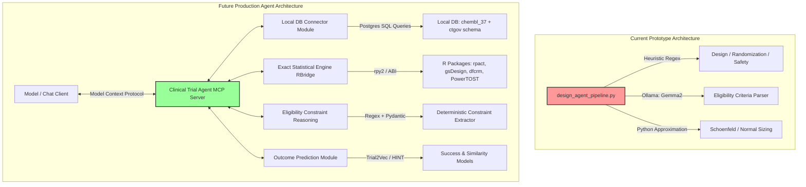
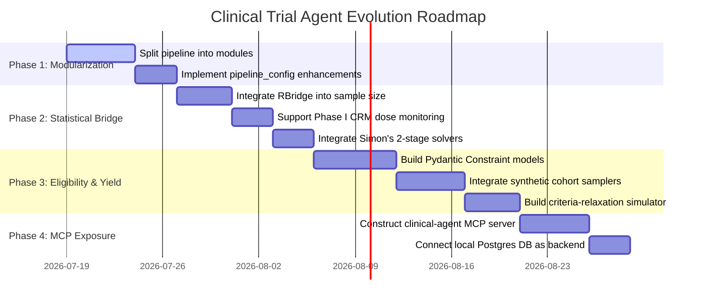

# Roadmap: Advanced Local Clinical Trial Analysis Agent

This document details the architectural evolution and step-by-step roadmap to transition our clinical trial analysis agent from a single-file prototype into a modular, production-grade, multi-agent system powered by exact statistical engines and standardized data layers.

---

## 🗺️ Current vs. Future Architecture

Currently, the pipeline operates as a single-file script ([design_agent_pipeline.py](file:///Users/leelasdodda/Documents/Codes/local_clintrial_agent/design_agent_pipeline.py)) that relies on heuristic keyword parsing, simple statistical approximations (e.g., Schoenfeld's formula), and loose LLM classification. 

The future state transitions to a **Modular Multi-Agent Kernel** exposed via an **MCP (Model Context Protocol) Server**, fetching exact parameters from an **R-to-Python Bridge** and querying a local **PostgreSQL database containing both AACT (clinical_trials.ctgov) and ChEMBL (chembl_37)**.

---

## 🚀 The 4 Core pillars of the New Agent

### 1. Unified R-to-Python Statistical Kernel (`RBridge`)
Instead of rough approximations, the agent will dynamically query the verified [examples/rpy2_bridge.py](file:///Users/leelasdodda/Documents/Codes/local_clintrial_agent/examples/rpy2_bridge.py) library we created:
*   **Group Sequential Designs:** Swap Python solvers for `rpact` and `gsDesign` to calculate exact boundary thresholds, information rates, and alpha-spending curves (complying with LGPL-3 copyleft rules).
*   **Phase I Dose Escalation:** Run continual reassessment simulations (`dfcrm` / `ewoc`) to predict Dose-Limiting Toxicity (DLT) probabilities.
*   **Simon's Two-Stage futility:** Solve optimal/minimax interim stopping thresholds for Phase II oncology trials (`clinfun`).
*   **Crossover Sizing:** Calculate true bioequivalence power using `PowerTOST`.

### 2. Deterministic Eligibility Extraction & Cohort Widening
Loose LLM categorizations are replaced by a structured extraction system inspired by `TrialMatchAI`:
*   **Constraint Parser:** Build a deterministic regex/Pydantic-based parser (`Constraint` objects with comparators like `age.ge(18)`, `ecog.le(2)`) to extract numerical criteria boundaries from the text protocol.
*   **Enrollment-Yield Simulation:** Use PyTrial's tabular simulators (`CTGAN`, `GaussianCopula`) or simplified statistical samplers (`biostats::clinical_data()`) to generate synthetic patient cohorts.
*   **Widening Scenarios:** Calculate expected enrollment-yield multiplier effects when widening eligibility criteria boundaries (e.g., widening age from `[18-65]` to `[18-75]` or relaxing biomarker counts).

### 3. Local PostgreSQL Clinical Trial Database Setup (AACT + ChEMBL)
Expose and query the local PostgreSQL databases (`chembl_37` and `clinical_trials` via FDW bridge) as the primary data source:
*   **Structured Queries:** Perform SQL queries against `ctgov.studies`, `ctgov.designs`, `ctgov.design_groups`, `ctgov.eligibilities`, and `ctgov.reported_events` to retrieve accurate, low-latency trial details.
*   **Drug & Target Cross-Referencing:** Query the `bridge.chembl_clinical_trials` and `molecule_dictionary` tables to link NCT IDs to standard drug names, targets, and Max Phase indicators.
*   **Adverse Events & Endpoints:** Inspect structured event listings in `ctgov.reported_events` and trial endpoints in `ctgov.design_outcomes` to support toxicity and power assessments.

### 4. Outcome & Feasibility Prediction
Introduce machine learning models to predict operational feasibility and clinical outcome success:
*   **Outcome Prediction:** Leverage PyTrial outcome prediction patterns (such as the HINT model architecture) to output a predicted approval success probability (%) based on indication, molecule type, phase, and eligibility criteria structure.
*   **Trial Similarity:** Use a dual BM25 + Vector embedding search with Reciprocal-Rank Fusion (RRF) to query and compare the target design against historical databases of approved/failed trials.

---

## 📅 Step-by-Step Implementation Roadmap

### Phase 1: Core Modularization & SQL Data Layer (Target: Week 1)
*   Break down [design_agent_pipeline.py](file:///Users/leelasdodda/Documents/Codes/local_clintrial_agent/design_agent_pipeline.py) into separate domain packages:
    *   `clintrial_agent/data/` (Local PostgreSQL connector for AACT + ChEMBL, parsing kernel).
    *   `clintrial_agent/stats/` (Approximations & R-Bridge solvers).
    *   `clintrial_agent/llm/` (Ollama client, structured prompting schemas).
    *   `clintrial_agent/reporting/` (JSON outputs, power curve visualizers).
*   Add configuration parameters in [pipeline_config.yaml](file:///Users/leelasdodda/Documents/Codes/local_clintrial_agent/pipeline_config.yaml) to choose between `"Python-approx"` and `"R-exact"` calculation modes.

### Phase 2: R-Bridge Integration (Target: Week 2)
*   Modify `analyze_sample_size()` to import the `RBridge` from `examples.rpy2_bridge` dynamically.
*   Hook up `rpact_sample_size_survival` for survival trials, `gsdesign_exact_binomial` for rare-event/single-arm trials, and `powertost_sample_size` for crossover trials.
*   Hook up `dfcrm_crm` to output recommendation vectors for Phase I dose-finding trials.
*   Create detailed statistical reports under `analysis_json/` comparing exact boundary scores vs. the heuristic targets.

### Phase 3: Structured Eligibility & Cohort Simulation (Target: Week 3)
*   Define a Pydantic schema for `Constraint` records.
*   Develop a regex parser to translate LLM-parsed text criteria (like "Age >= 18", "ECOG performance status <= 2") into deterministic `Constraint` metrics.
*   Implement a synthetic cohort generator using statistical samplers (representing disease prevalence, age demographics, etc.).
*   Create a simulator to report how changing age bounds, liver function indices (AST/ALT thresholds), or treatment histories alters the eligible cohort percentage.

### Phase 4: MCP Server Deployment (Target: Week 4)
*   Write an MCP server wrapper (`clinical_agent_mcp.py`) using the official Python MCP SDK.
*   Expose tools: `analyze_nct_id`, `simulate_recruitment`, `calculate_sequential_boundaries`, `compare_portfolio`, `query_chembl_drug`.
*   Integrate it with local developer clients to allow natural language queries directly over the local clinical trials + ChEMBL database.

---

## 🔒 Approved Design Decisions

The following architectural choices have been finalized:
1. **RBridge Execution Mode:** Run R scripts **in-process** via `rpy2` (using the ABI-compatible wrapper in [examples/rpy2_bridge.py](file:///Users/leelasdodda/Documents/Codes/local_clintrial_agent/examples/rpy2_bridge.py)) to maintain speed, shared memory, and a direct Python interface.
2. **Cohort Simulation:** Attempt cohort generation using `PyTrial` (e.g., `CTGAN` or `MedGAN`). If library conflicts, package-skew issues, or CUDA/dependency errors occur, the pipeline will gracefully fall back to **simplified statistical distribution models** (such as normal/log-normal prevalence models for ages and lab values).
