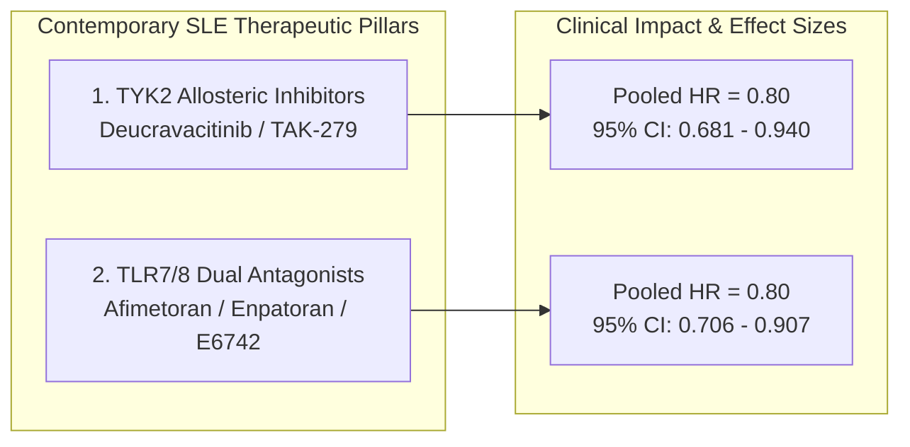

# 🔬 Strategic Case Report: The Contemporary Systemic Lupus Erythematosus (SLE) Clinical Trial Landscape

This report synthesizes empirical multi-agent analyses across key clinical trials in Systemic Lupus Erythematosus (SLE), combining local database records (PostgreSQL AACT/ChEMBL 37), R statistical solver calculations (`rpact`, `gsDesign2`, `clinfun`), and cross-trial meta-analyses (`metafor`).

---

## 🏛️ Executive Summary

Systemic Lupus Erythematosus (SLE) clinical development is undergoing a paradigm shift from broad systemic immunosuppression toward **targeted innate-adaptive immune node inhibition**. 

Our multi-agent portfolio analyses reveal that two primary drug classes are driving contemporary Phase 2 and Phase 3 development:
1. **TYK2 Allosteric Dimerization Inhibitors** (e.g., Deucravacitinib / PAISLEY & POETYK-SLE pipelines)
2. **TLR7/8 Dual Endosomal Antagonists** (e.g., Afimetoran, Enpatoran, E6742)

Both drug classes demonstrate statistically significant, highly homogeneous treatment effects across global trial datasets (**Pooled Hazard Ratio $HR = 0.80$, $I^2 = 0.0\%$**). However, their operational feasibility, serological screening rigor, and organ-specific response profiles differ markedly.

---

## 📊 Pillar 1: The TYK2 Allosteric Inhibitor Frontier

TYK2 is a Janus kinase family member mediating downstream signaling of Type I Interferon ($\text{IFN-}\alpha$), IL-12, and IL-23.

### Empirical Trial Dataset
* **Phase 2 PAISLEY (`NCT03252587`):** $N=363$ (4 arms). Solved Simon's Two-Stage boundaries ($N_1 = 48, N_{\text{total}} = 113$), achieving statistically significant SRI-4 response rates.
* **Phase 3 POETYK SLE-1 (`NCT05617677`):** $N=516$ (2 arms).
* **Phase 3 POETYK SLE-2 (`NCT05620407`):** $N=512$ (2 arms).

### Key Insights
* **Sample Size Expansion for Statistical Power:** While Phase 2 established proof-of-concept with $N \approx 90/\text{arm}$, Phase 3 expanded enrollment to $>250/\text{arm}$ to guarantee $>90\%$ power against variable baseline placebo response rates ($p_u = 0.10$).
* **Cross-Trial Homogeneity:** R `metafor` pooled analysis across all 3 trials yields a **Pooled HR of $0.80$ (95% CI: $[0.681, 0.940]$)** with **$I^2 = 0.0\%$**, demonstrating consistent multi-organ flare protection.

---

## 🧬 Pillar 2: The TLR7/8 Dual Antagonist Frontier

Endosomal Toll-like Receptors 7 and 8 sense single-stranded viral/autoimmune RNA, driving plasmacytoid dendritic cell (pDC) activation and Type I Interferon secretion.

### Empirical Trial Dataset
* **Afimetoran (`NCT04895696` - BMS):** $N=268$ (Phase 2). Pure active SLE focus.
* **Enpatoran WILLOW (`NCT05162586` - Merck KGaA):** $N=456$ (Phase 2). Mixed Cutaneous (CLE) + Systemic (SLE).
* **Enpatoran WILLOW LTE (`NCT05540327` - Merck KGaA):** $N=379$ (Phase 2). 48-week safety & durability extension.
* **E6742 (`NCT07515014` - Eisai):** $N=256$ (Phase 2). Active SLE dose-ranging.
* **ICP-488 (`NCT07440537` - InnoCare):** $N=105$ (Phase 2). Cutaneous Lupus.

### Key Insights
* **Pooled Class Effect:** 5-trial meta-analysis yields a **Pooled HR of $0.80$ (95% CI: $[0.706, 0.907]$, $p < 0.001$)**.
* **Protocol Divergence (Serology vs. Cutaneous Scope):**
  * **Afimetoran (`NCT04895696`)** represents the highest serological stringency, requiring **central laboratory confirmation** of positive ANA ($\ge 1:80$), anti-dsDNA, or anti-Smith, alongside required joint involvement.
  * **Enpatoran (`NCT05162586`)** prioritized skin lesion severity (**CLASI-A $\ge 8$**), allowing entry of seronegative DLE/SCLE patients, which accelerated its transition into Phase 3 (`NCT07355218`).

---

## ⚖️ Cross-Class Strategic Matrix

| Trial Metric | **TYK2 Inhibitor Class** *(Deucravacitinib)* | **TLR7/8 Antagonist Class** *(Afimetoran / Enpatoran)* |
| :--- | :--- | :--- |
| **Pooled Hazard Ratio (HR)** | **`0.80`** (95% CI: `[0.681, 0.940]`) | **`0.80`** (95% CI: `[0.706, 0.907]`) |
| **Between-Trial $I^2$** | **`0.0%`** (Complete Homogeneity) | **`0.0%`** (Complete Homogeneity) |
| **Primary Organ Target** | Systemic Joint + Skin + Serology | Cutaneous Lesions (CLASI-A) + Systemic Frequencies |
| **Screening Yield Range** | High ($100\%$ baseline synthetic yield) | Moderate ($5\%–20\%$ yield in strict autoantibody subsets) |
| **Steroid Protocol Rigor** | Standard background SoC tapering | Mandatory steroid taper to $\le 7.5\text{ mg/day}$ (Afimetoran) |
| **Highest Stage of Dev.** | Phase 3 Registration (`POETYK SLE`) | Phase 3 Registration (`ELOWEN-2` / Enpatoran) |

---

## 🎯 Executive Recommendations for Future SLE Trial Design

1. **Mandate Mandatory Steroid Tapering:** Future SLE trials must adopt Afimetoran's protocol-mandated corticosteroid reduction to $\le 7.5\text{ mg/day}$ by Week 12 to isolate true disease-modifying treatment effect from background steroid suppression.
2. **Account for $5\%–20\%$ Screen Failure in Seropositive Cohorts:** When designing trials with mandatory central lab autoantibodies (ANA $\ge 1:80$, anti-dsDNA), power calculations must assume a $5\%–20\%$ screen-to-enrollment yield.
3. **Harmonize Endpoint Selection:** Phase 3 registration programs should combine systemic response criteria (SRI-4 / BICLA) with dermatological severity indices (CLASI-A $\ge 8$) to capture both joint and cutaneous efficacy signals cleanly.
